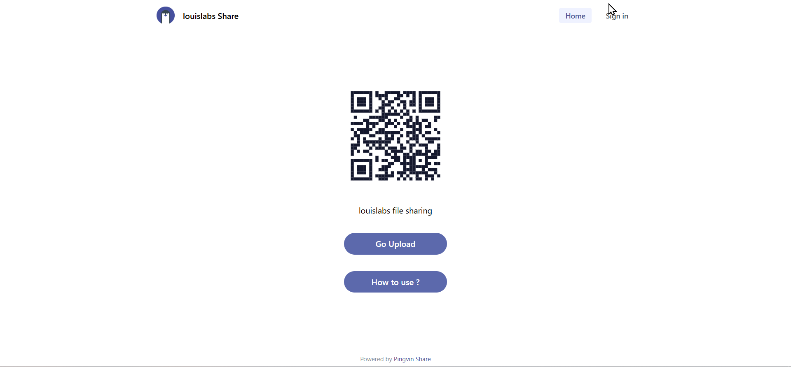
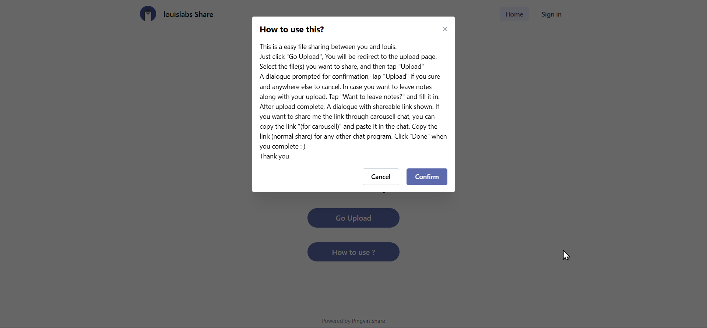
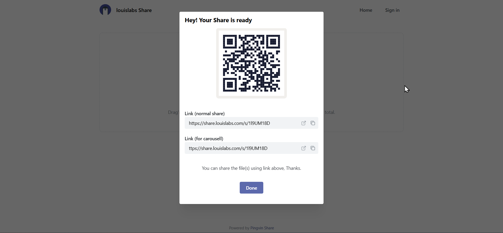
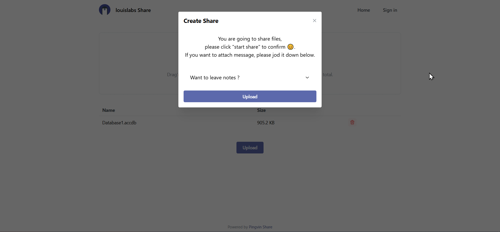
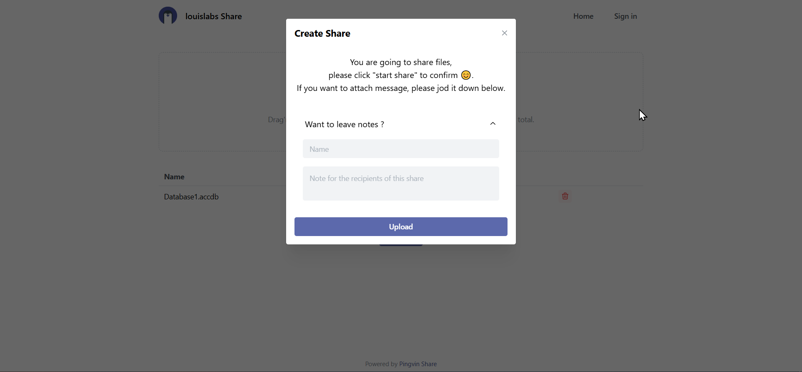
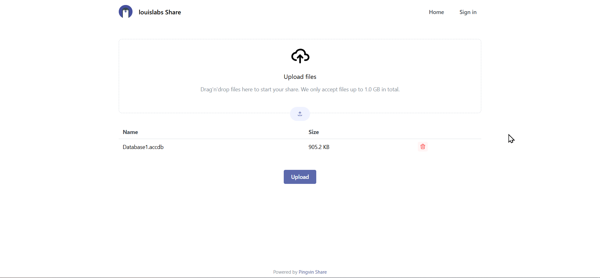
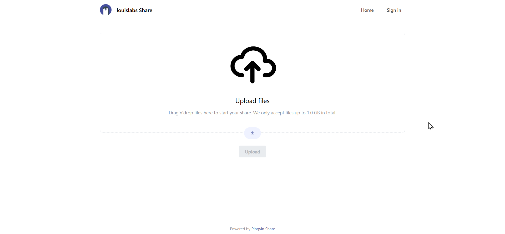
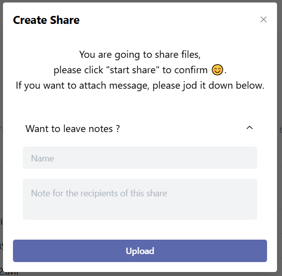

# Update UI

## Description

clone project

from github (<https://github.com/stonith404/pingvin-share>)

to louis (<https://github.com/louiscklaw/pingvin-share>)

## Project Home

`/home/logic/_wsl_workspace/001_github_ws/pingvin-share`

## Purpose

hide original not necessary message

| screen name                   | screen capture                            |
| ----------------------------- | ----------------------------------------- |
| 001_landing                   |                    |
| 002_how_to_use                |                 |
| 003_share_ready_QR            |             |
| 004_create_share              |               |
| 005_create_share_w_comment    |     |
| 006_upload_files              |               |
| 007_upload_waiting_user_input |  |
| 008_create_share_dialog       |        |
