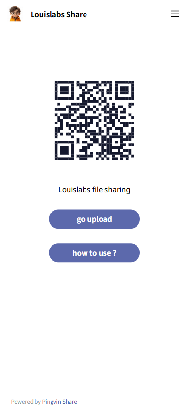
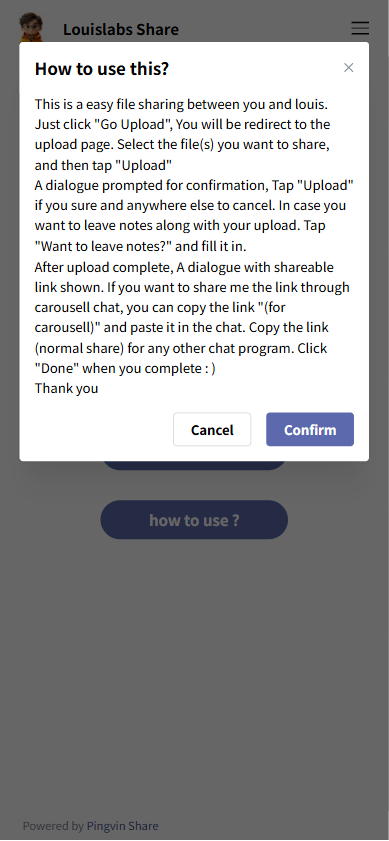
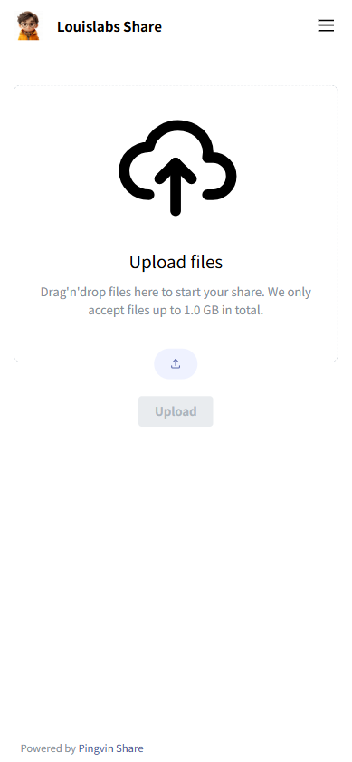
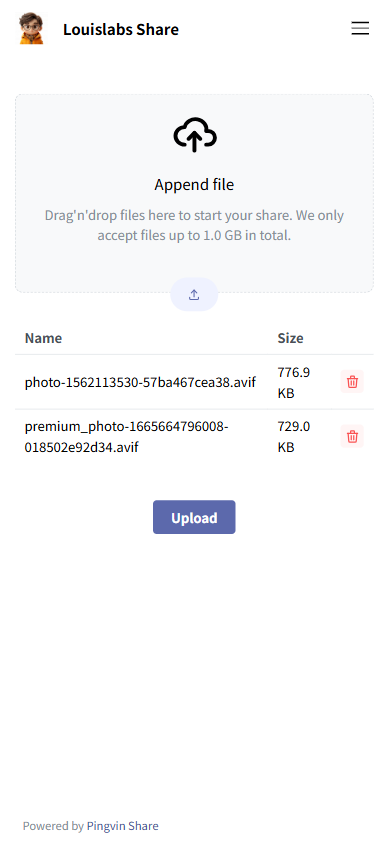
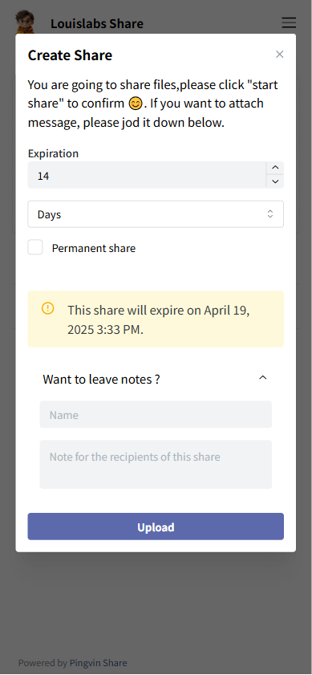
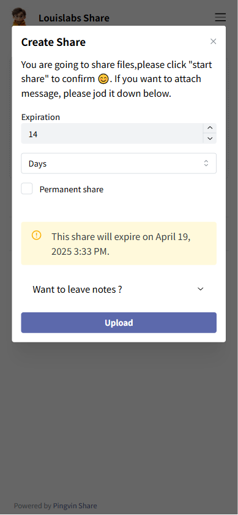
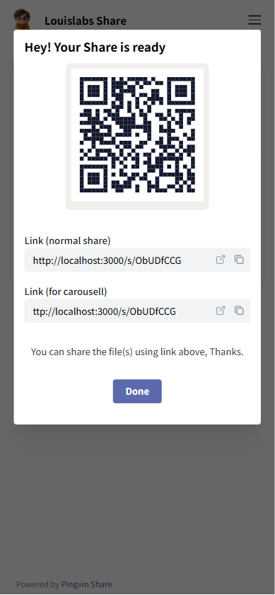

# Update favicon

## Description

update favicon of site in docker image

| name                             | purpose                                                                     |
| -------------------------------- | --------------------------------------------------------------------------- |
| 001_landing                      |                                            |
| 002_how_to_use                   |                                      |
| 003_waiting_for_user_upload_file |  |
| 004_upload_file_list_showing     |          |
| 005_create_share_with_comment    |        |
| 005_create_share_wo_comment      |            |
| 006_create_share_done            |                        |
