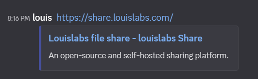

# Update opengraph preview

## Description

fix opengraph preview for page

### for example

it is easier for user to understand what's site will redirect to if we can show the thumbnail to it.

### key points

- need a thumbnail of my page
- need to update `An open-source and self-hosted sharing platform`
